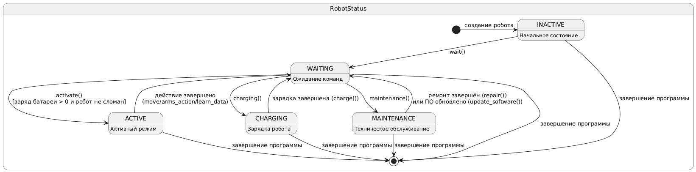

## ⚗️ Лабораторная работа №1

### Вариант 42

Предметная область: создание и использование робототехнических систем.

Важные сущности: робот, сенсоры, программное обеспечение, механизмы, энергозависимость, управление.

Операции: операция программирования робота, операция взаимодействия с окружающей средой, операция обучения, операция технического обслуживания, операция управления и мониторинга.

## 📌 О программе
Программа представляет собой имитационную модель робота, оснащённого сенсорами, механическими манипуляторами, системой передвижения и программным обеспечением.

### Робот способен:
- Перемещаться в различных направлениях
- Взаимодействовать с окуружающей средой подбирая и бросая предметы
- Считывать данные с установленных сенсоров ( на выбор температурный, сенсор расстояния, GPS-сенсор, оптический)
- Обучаться новым фразам и произносить их
- Заряжаться
- Подвергаться износу и ремонтироваться

Управление роботом осуществляется через интерфейс командной строки. Состояние системы можно сохранять или загружать в JSON-файл.

## 🎮 Интерфейс командной строки
При запуске программы отображается главное меню. Все команды вводятся цифрами.

### 🔹 Создание робота
При первом запуске робот создаётся автоматически с именем, которое указывает пользователь. Далее идет основное меню программы.

### 🔹 Основные команды

| Команда | Действие | Запрашиваемые данные |
|---------|----------|---------------------|
| 1 | Создать нового робота | Имя робота |
| 2 | Зарядить робота | Количество энергии (%) |
| 3 | Движение | Скорость, направление, время |
| 4 | Захват предметов | Список предметов |
| 5 | Статус робота | – |
| 6 | Техобслуживание (ремонт) | Подтверждение ТО |
| 7 | Программирование ПО | Название ПО, версия ПО |
| 8 | Обучение фразам | Список фраз |
| 9 | Сказать фразу | – |
| 10 | Сохранить состояние | – |
| 11 | Загрузить состояние | – |
| 0 | Выход | – |

## 📊 Диаграмма классов
Диаграмма классов отражает иерархию наследования, композицию и агрегацию между основными компонентами системы. Диаграмма классов данной программы представлена ниже

### Ключевые элементы:
- `Device` – базовый класс для компонентов с износом
- `Sensor` – абстрактный класс сенсора; наследники:
  - TemperatureSensor - температурный сенсор
  - OpticalSensor - оптический сенсор
  - DistanceSensor - дистанционный сенсор
  - GPSSensor - сенсор положения в пространстве
- `ArmMechanism`, `LegMechanism` – механизмы робота
- `Battery` – батарея робота для управления зарядом
- `Software` – ПО робота
- `Robot` – центральный класс, объединяющий все компоненты
- `ControlSystem` – система управления роботом
- `DefaultFabric` / `Fabric` – фабрика создания компонентов
- `Serializer` – сохранение/загрузка состояния
- Перечисления: `SensorType`, `RobotStatus`, `Direction`

## 🔁 Диаграмма состояний
Диаграмма описывает жизненный цикл робота – возможные состояния и переходы между ними. Подробное описание состояний описано ниже

### Состояния:
- `INACTIVE` – начальное состояние после создания робота
- `WAITING` – робот ожидает команд
- `ACTIVE` – взаимодействие с окружающей средой (движение, захват, обучение)
- `CHARGING` – зарядка робота
- `MAINTENANCE` – техническое обслуживание (ремонт, обновление ПО)
