## ⚗️ Лабораторная работа №2

### Вариант 1

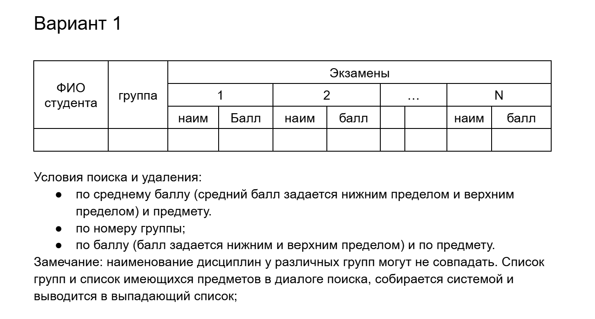

### Используемые технологии
  - sqlalchemy
  - PostgeSQL
  - PySide6
  
### Функциональные возможности программы
  - Запись/загрузка данных из БД
  - Сохранение/загрузка данных в файлы .xml
  - Добавление студентов
  - Удаление студентов по заданным условиям
  - Поиск студентов по заданным условиям
  - Отображение списка записей в виде дерева
  - Постраничное отображение записей (пагинация)

## 💻 Демонстрация работы программы

При запуске программы пользователю предлагается выбор: загрузить записи из БД или загрузить данные из файла.

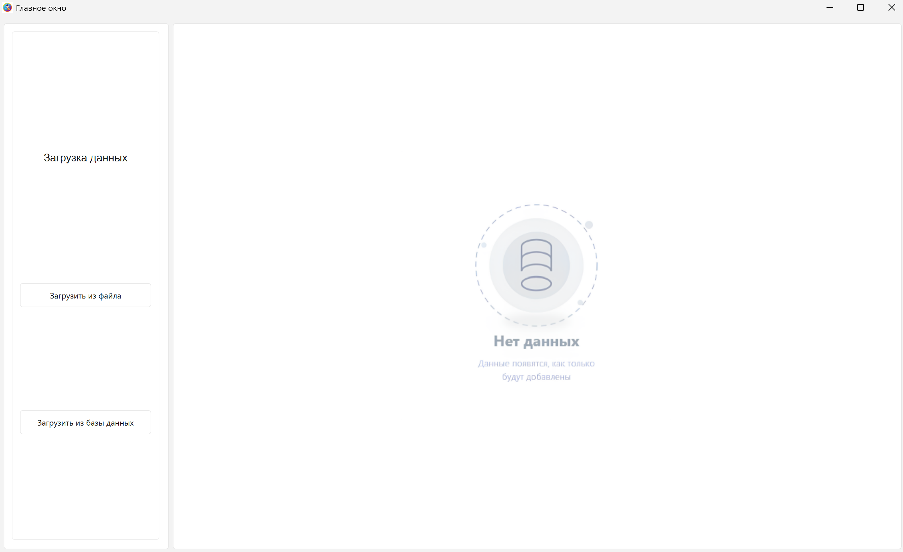

При выборе пользователем варианта загрузки записей из файла, пользователю показывается диалоговое окно, где он выбирает файл для загрузки

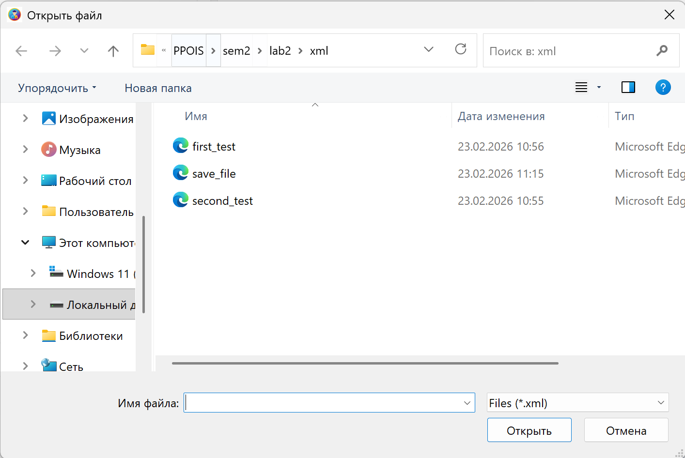

Если же пользователь выбрал загрузку записей из БД, то никакого диалогового окна он не увидит и ему покажется заполненная таблица с записями

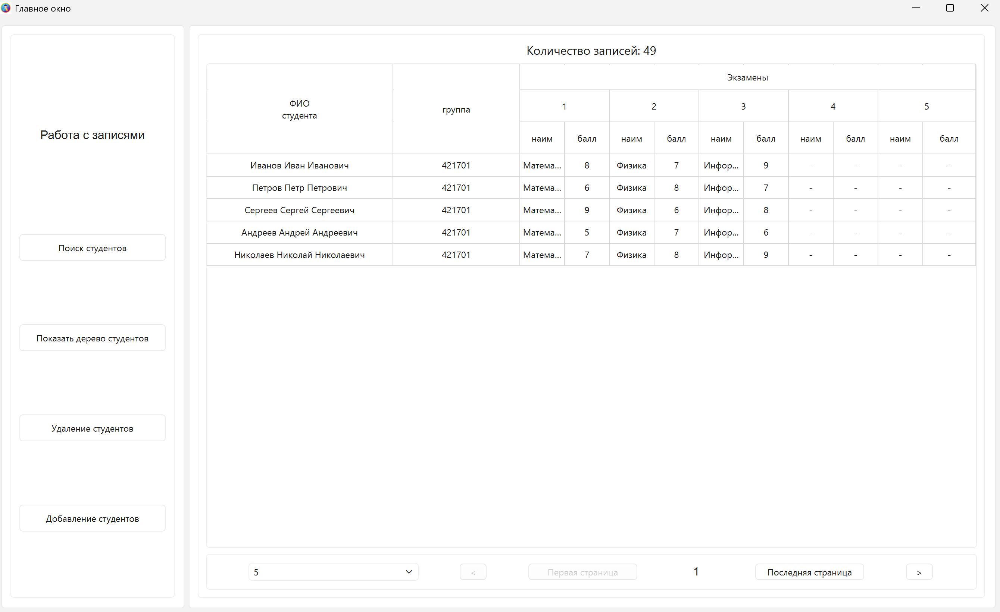

После загрузки данных, пользователю предоставляется возможность работы с этими данными: производить поиск, удаление, добавления и просмотра дерева записей.

### Поиск записей

При нажатии на кнопку "Поиск студентов" пользователю отображается окно с фильтрами для поиска

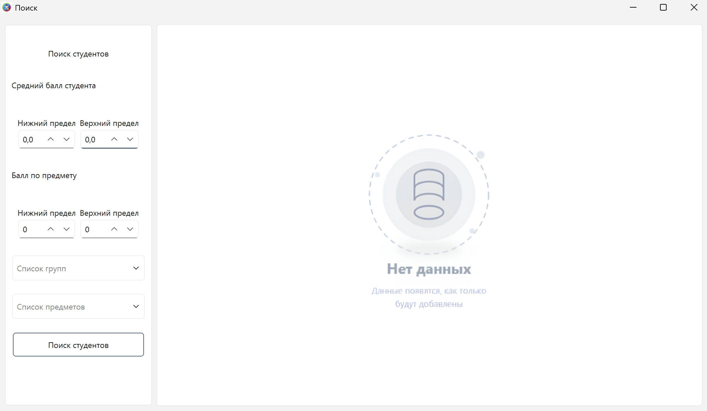

Пользователь может по этим фильтрам получить нужных ему студентов. При правильной настройке фильтров пользователю высвечивается уведомление о количестве найденных записей.

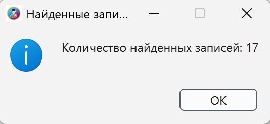

И вывод этих записей в постраничном виде

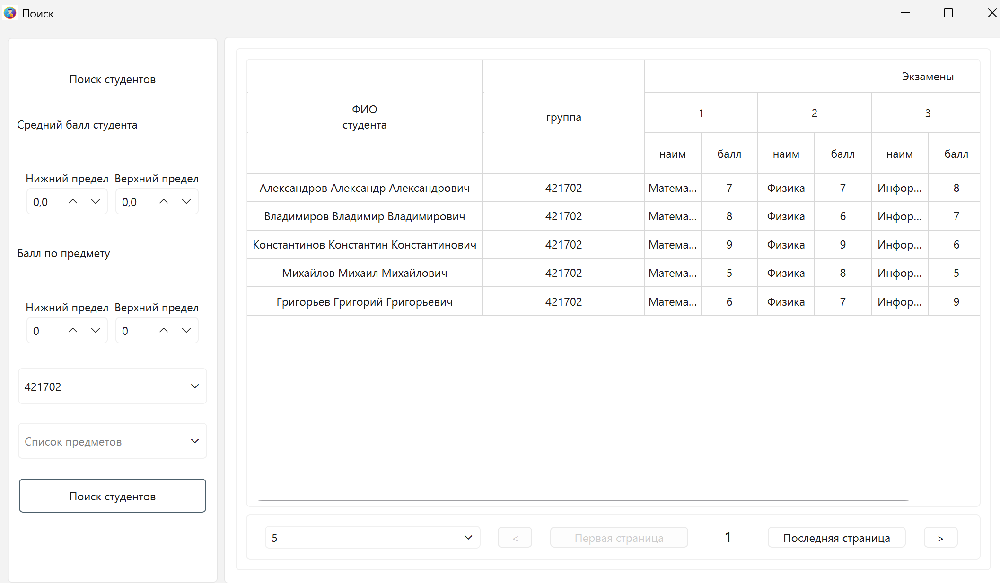

При неправильной настройке фильтров, пользователю высветится уведомление о том, что он сделал не так.

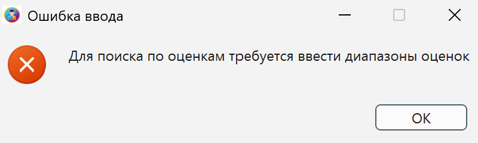

### Дерево студентов

При нажатии на кнопку "Показать дерево студентов", пользователю отображается дерево студентов, где корни это номера групп студентов, а листья сами студенты

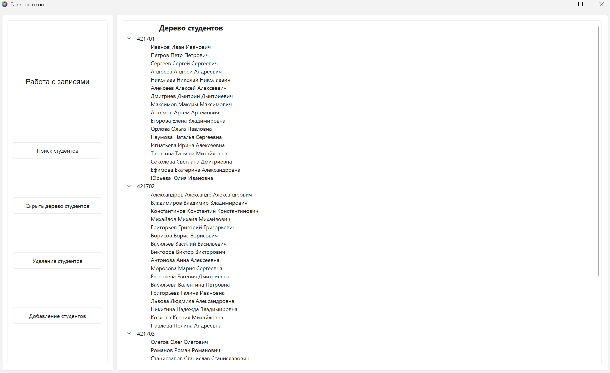

При этом кнопка "Показать дерево студентов" заменяется на кнопку "Скрыть дерево студентов", которая уже ведет на экран с постраничным отображением записей студентов.

### Удаление студентов

При нажатии на кнопку "Удаление студентов", пользователю отображается диалоговое окно с фильтрами для удаления студентов.

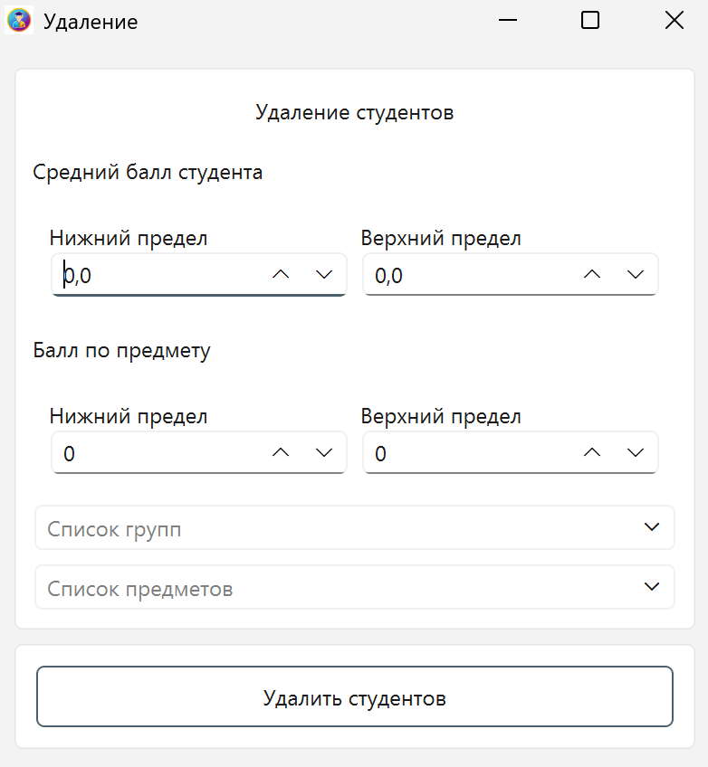

При правильной настройке фильтров пользователю отобразится уведомление о том, сколько записей было удалено.

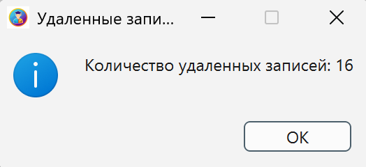

При неправильной настройке фильтров пользователю отобразится уведомление о неправильной настройке фильтров с сообщением об ошибке.

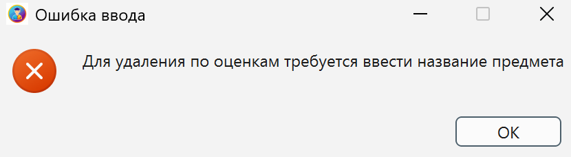

При закрытии окна пользователю предоставляется выбор о сохранении изменений в файл.

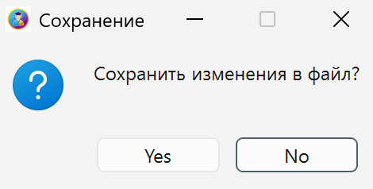

При выборе нажатии кнопки "Yes", пользователю отображается диалог выбора файла. Он такой же как и при выборе файла загрузки.

### Добавление студентов

При нажатии на кнопку "Добавление студентов" пользователю отображается диалоговое окно с полями для ввода информации о студенте.

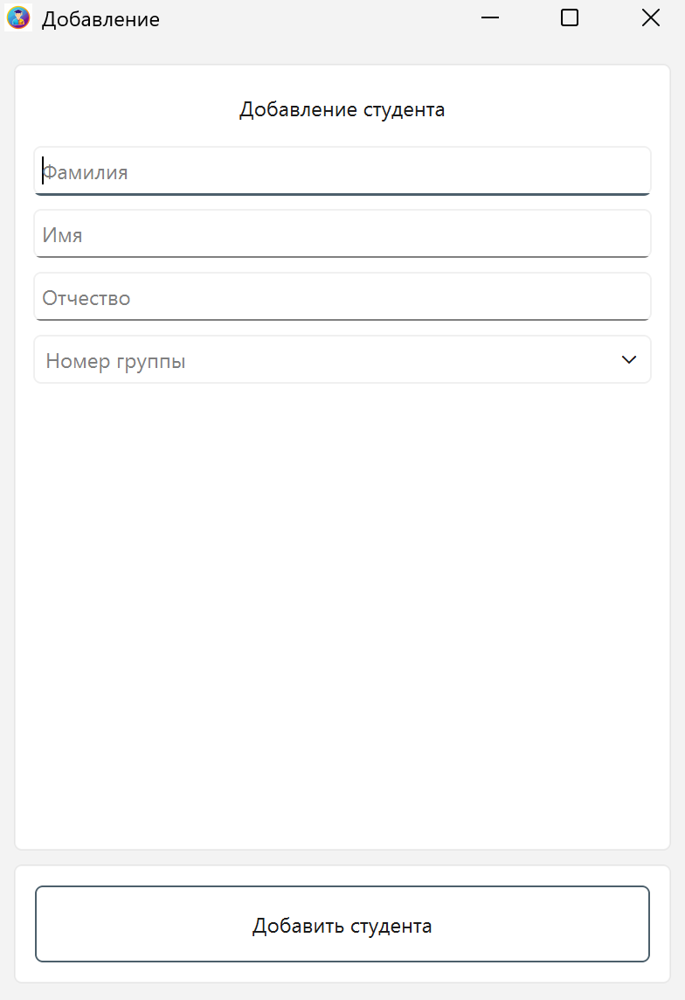

При выборе группы для студента ниже динамически подружаются экзамены для выбранной группы.

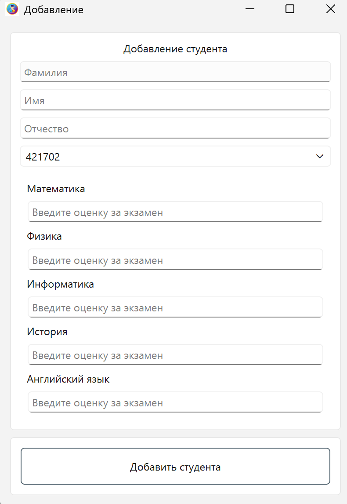

Далее при правильном заполнении формы пользователю отображается уведомление о успешном добавлении студента.

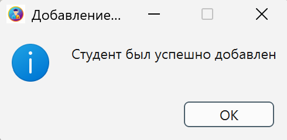

Если же форма была заполнена некорректно, пользователю отображается уведомление об ошибке ввода.

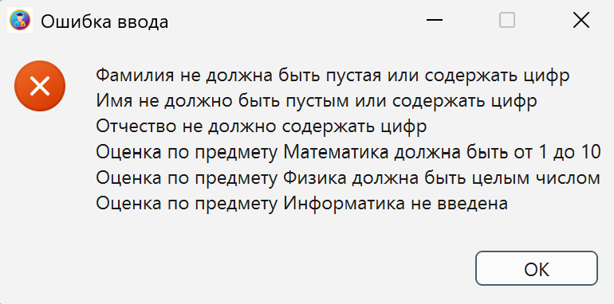

При закрытии окна пользователю также предлогается сохранения записей в файл (см. Удаление студентов)

## 📊 Вывод

В результате лабораторной работы был разработан GUI для взаимодействия с базой данных студентов и реализовал выполнение CRUD операций с данными о студентах.