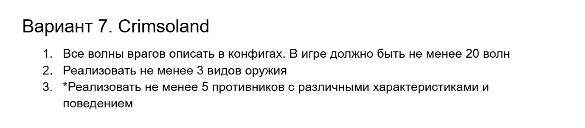

## ⚗️ Лабораторная работа №3

### 🎯 Цель

Изучить событийно-ориентированное программирование с использованием библиотеки на языке Python.

### Вариант 7

### ⚙️ Используемые технологии
  - Pygame
  
### 📱 Функциональные возможности игры
  - Запись/Просмотр таблицы лидеров
  - Просмотр правил игры
  - Выход из игры
  - Убийство врагов
  - Анимации смерти/движения/атаки у врагов
  - Анимации пропадания бонусов
  - Звуковые эффекты для стрельбы/перезарядки
  - Фоновая музыка для меню/игрового экрана
  - Передвижение игрока на WASD
  - Анимация полета пули
  - Автоматическая перезарядка игрока или по нажатию на R
  - 3 различных вида оружия (пистолет, дробовик, автомат)
  - 2 вида бонусов (аптечка, ускоритель)
  - 5 видов врагов (зомби, паук, ящер, дикий пес, громила)
  - 20 волн с различной комбинацией врагов

## 📊 Вывод

В результате лабораторной работы была разработана полноценная игра с анимациями и звуковыми эффектами.